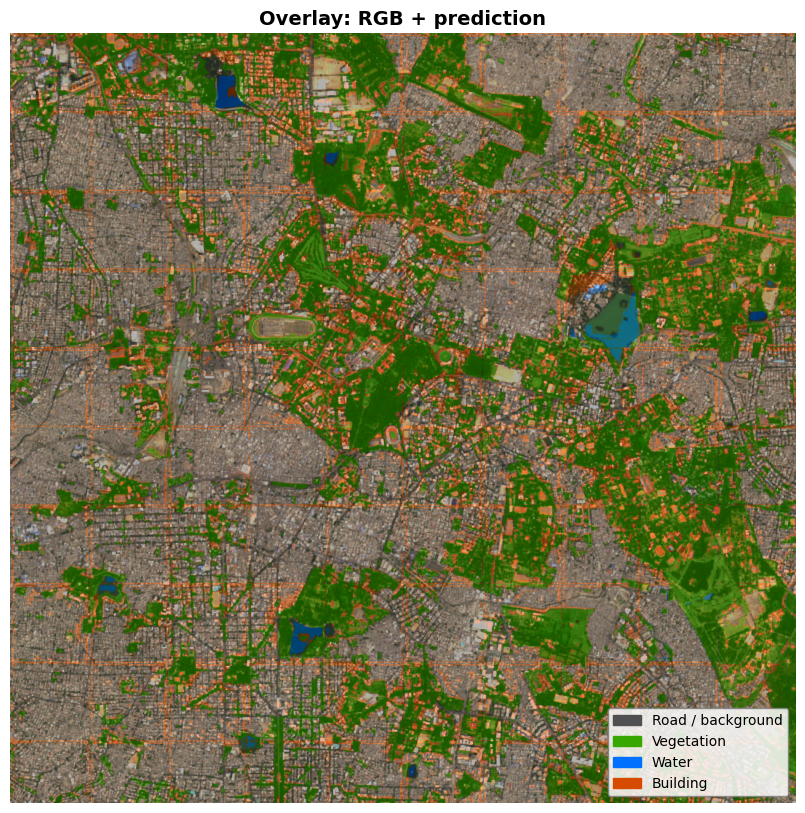

Here’s the updated **simple README with your note added** 👇

---

# Satellite Image Segmentation

This project performs land-cover segmentation on satellite images using deep learning.
It classifies each pixel into:

* Road / Background
* Vegetation
* Water
* Building

---

## Note

This code has been developed and executed in **Google Colab Notebook**.

---

## Workflow

Satellite Image → Mask Creation → Tile Generation → Model Training → Prediction

---

## Files

* `input_data.py` → creates mask using NDVI, NDWI, and OSM 
* `create_tiles.py` → splits image into tiles 
* `training_curve.py` → trains model and saves best weights 
* `predictions.py` → runs inference and generates outputs 
* `map_generation.py` → visualization

---

## How to Run

```bash
pip install rasterio geopandas osmnx pyproj matplotlib torch torchvision segmentation-models-pytorch
```

```bash
python input_data.py
python create_tiles.py
python training_curve.py
python predictions.py
```

---

## Output

* Segmentation map
* Overlay image
* GeoTIFF file
## Output



---

## Classes

| ID | Class             |
| -- | ----------------- |
| 0  | Road / Background |
| 1  | Vegetation        |
| 2  | Water             |
| 3  | Building          |

---


